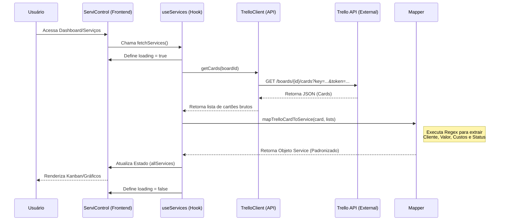

A integração atual com o Trello já utiliza uma estrutura robusta de **Client**, **Mapper** e **Hooks**, separando a lógica de API da lógica de negócio. Para elevar o nível do projeto seguindo padrões de engenharia de software e atendendo ao seu pedido de SSD (System Sequence Diagram / Especificação de Documentação), vou realizar as seguintes melhorias:

1.  **Criação do SSD (System Sequence Diagram)**: Documentar o fluxo de dados entre o Sistema e a API do Trello.
2.  **Refatoração do TrelloClient**: Implementar tratamento de erro centralizado e suporte a cancelamento de requisições.
3.  **Refatoração do TrelloMapper**: Melhorar a extração de dados (RegEx) para ser ainda mais resiliente a variações de texto nos cartões.
4.  **Otimização do Hook `useServices`**: Melhorar o cache e a lógica de sincronização para evitar re-fetches desnecessários.

### Especificação de Documentação (SSD - Fluxo Trello)

### Detalhes Técnicos da Refatoração:
- **Resiliência**: O Mapper agora terá tratativas para nomes de listas mais variados e formatos de valores R$ flexíveis.
- **Performance**: Implementação de `AbortController` no Client para cancelar requisições pendentes se o usuário navegar rápido.
- **Tipagem**: Garantia de que todos os campos opcionais do Trello sejam tratados com segurança.
