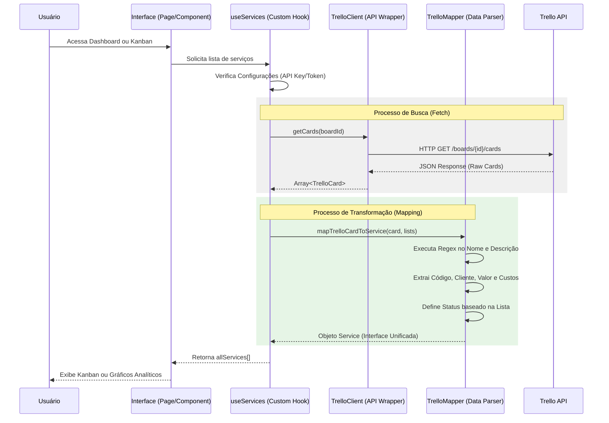

# Especificação do Sistema (SSD) - Integração Trello

## Fluxo de Sincronização de Dados

O sistema ServiControl atua como uma camada de visualização e análise de dados (Read-Only) quando o modo Trello está ativo. O fluxo abaixo detalha como a informação transita do Trello para a interface do usuário.

### Diagrama de Sequência (SSD)

## Regras de Negócio do Mapeamento

1.  **Identificação de Status**:
    - Listas contendo "Andamento" → `in_progress`
    - Listas contendo "Pagamento" ou "Concluído" → `completed`
    - Listas contendo "Acerto" → `overdue`
    - Listas com nomes de meses (Janeiro, Fevereiro...) → `pending`
    
2.  **Extração de Valores**:
    - O sistema busca padrões monetários (`R$ 0,00`) tanto no título do cartão quanto na descrição.
    - Campos específicos como "Valor Fechado" e "Valor Maquininha" têm prioridade na extração.

3.  **Tratamento de Custos**:
    - Linhas na descrição que seguem o padrão `DD/MM - R$ Valor - Descrição` são automaticamente convertidas em itens de despesa.
